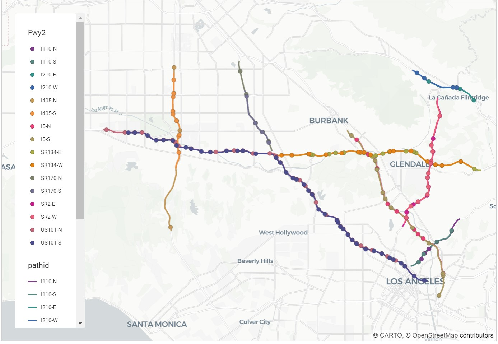
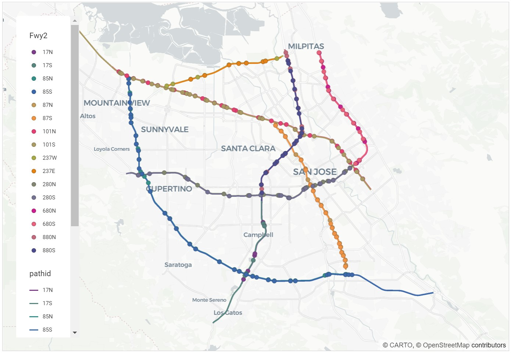
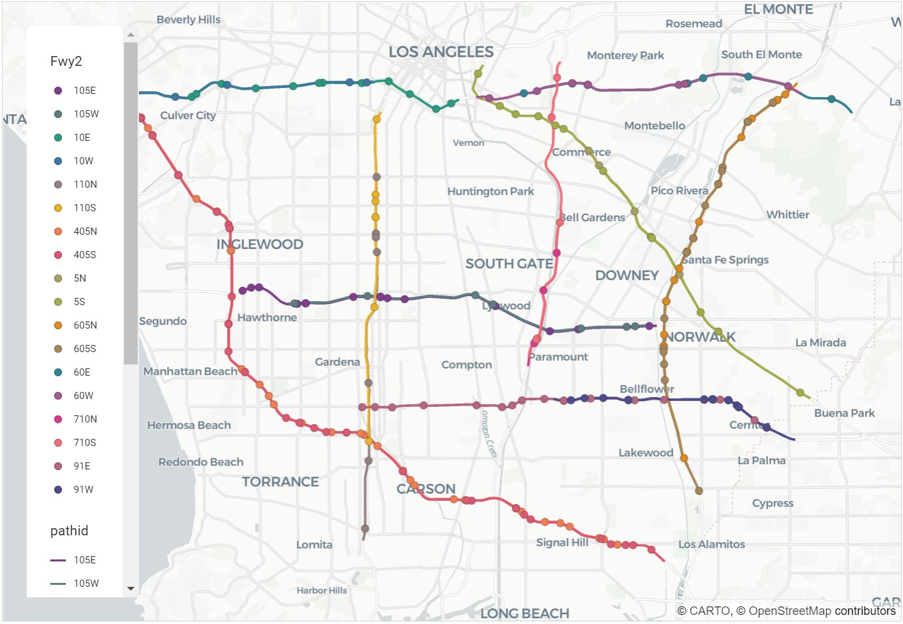
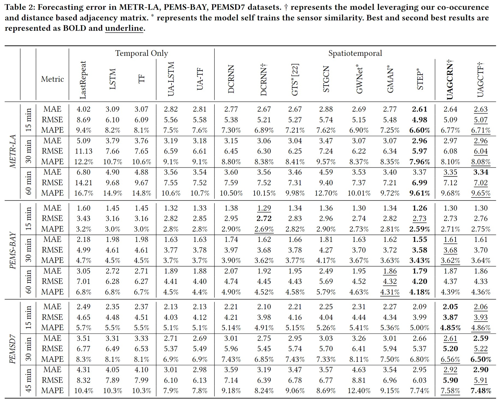
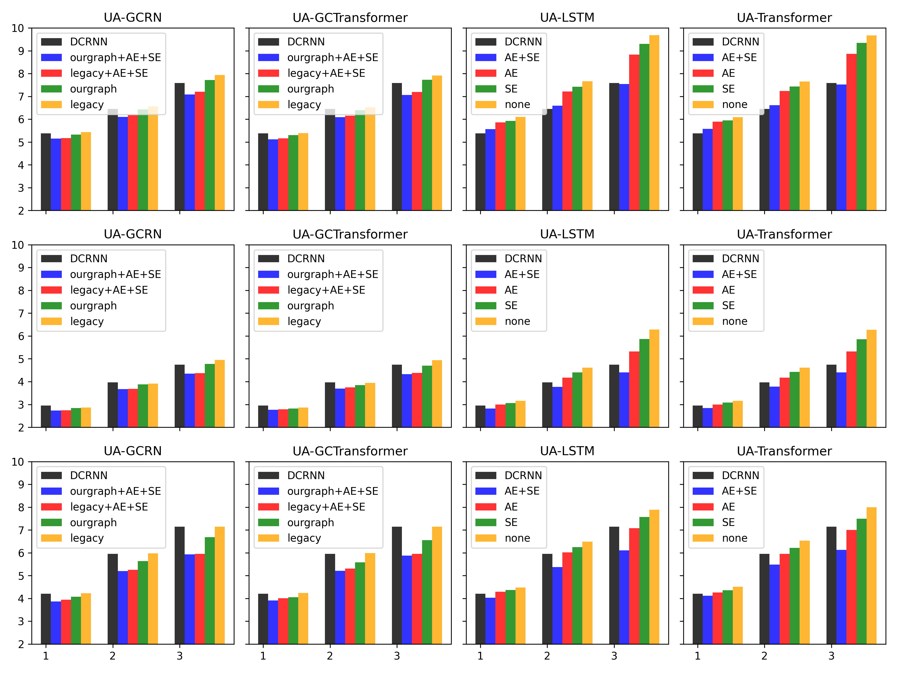

# Traffic-UAGCRNTF
Traffic Prediction models - UAGCRN and UAGCTransformer

# Code

This installation command worked with our code execution:

    conda deactivate
    conda env remove -n CIKM
    conda create -n CIKM -y
    conda activate CIKM 
    conda install python==3.10 -y
    pip install tensorflow-gpu==2.10.0
    pip install tqdm
    pip install tables
    pip install scipy==1.10.1
    pip install pandas==1.5.3
    pip install numpy==1.23.5
    
    python train.py --model_name=MyUAGCRN --dataset=metr-la --Q=12 --activity_embedding --sensor_embedding --graph_type=cooccur_dist
    python train.py --model_name=MyUAGCRN --dataset=pems-bay --Q=12 --activity_embedding --sensor_embedding --graph_type=cooccur_dist
    python train.py --model_name=MyUAGCRN --dataset=pemsd7 --Q=9 --activity_embedding --sensor_embedding --graph_type=cooccur_dist
    python train.py --model_name=MyUAGCTransformer --dataset=metr-la --Q=12 --activity_embedding --sensor_embedding --graph_type=cooccur_dist
    python train.py --model_name=MyUAGCTransformer --dataset=pems-bay --Q=12 --activity_embedding --sensor_embedding --graph_type=cooccur_dist
    python train.py --model_name=MyUAGCTransformer --dataset=pemsd7 --Q=9 --activity_embedding --sensor_embedding --graph_type=cooccur_dist

# Dataset 

## Traffic Dataset

* california-vds.json: https://pems.dot.ca.gov/

* metr-la, pems-bay: DCRNN, https://github.com/liyaguang/DCRNN

* pemsd7: STGCN, https://github.com/VeritasYin/STGCN_IJCAI-18

### Traffic Dataset Description

| DATASET                   | N   | Speed (miles/hour)  | Datasize | PLACE                       | DURATION                         | INTERVAL |
| ------------------------- | ------ | ------- | ---- | --------------------------- | -------------------------------- | -------- |
| METR_LA                   | 207    | 54 ± 20  | 34,249    | Los Angeles, USA            | Mar. 1, 2012 -   Jun. 27, 2012   | 5min     |
| PEMS_BAY                  | 325    | 62 ± 10   | 52,093    | San Francisco Bay Area, USA | Jan. 1, 2017 -   Jun. 30, 2017   | 5min     |
| PEMSD7                    |  228    | 59 ± 13     |  12,652   | Los Angeles, USA            | May. 1, 2012 - Jun.30, 2012   | 5min

## National Household Survey

### Citation

To recognize the valuable role of National Household Travel Survey (NHTS) data in the transportation research process and to facilitate repeatability of the research, users of NHTS data are asked to formally acknowledge the data source. Where possible, this acknowledgement should take place in the form of a formal citation, such as when writing a research report, planning document, on-line article, and other publications. The citation can be formatted as follows:
U.S. Department of Transportation, Federal Highway Administration, 2017 National Household Travel Survey. URL: http://nhts.ornl.gov.

### Download page

- https://nhts.ornl.gov/downloads
- survey data csv link: https://nhts.ornl.gov/assets/2016/download/csv.zip

# Sensor Location Correction

Corrected sensor location with osm path files are found in 
* METR-LA: dataset/corrected-metr-la-sensorid-osm-path-uv.csv
* PEMS-BAY: dataset/corrected-pemsbay-sensorid-osm-path-uv.csv
* PEMSD7: dataset/corrected-pemsd7-sensorid-osm-path-uv.csv

## METR-LA

## PEMS-BAY

## PEMSD7

# Performance Comparison

# Ablation Study

